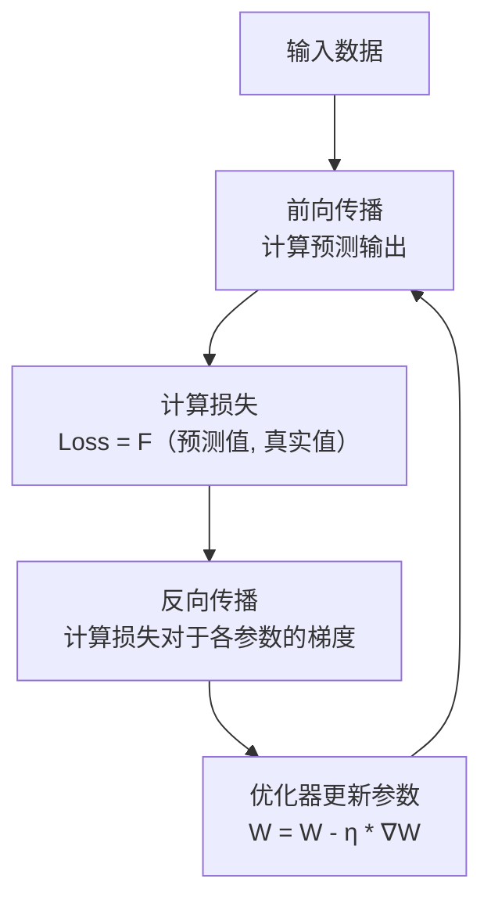

训练training
推理inference

dice

loss function

convolution

pooling

relu

sigmoid

softmax

cross entropy

batch normalization

dropout

gradient descent

adam

learning rate

optimizer

activation function

backpropagation

neural network

deep learning

tensorflow

pytorch

keras

cnn

rnn

lstm

gru

transformer

bert

gpt

gan

vae

autoencoder

attention mechanism

神经网络 术语

好的，神经网络领域的术语非常丰富。为了让你能系统地理解，我将它们分门别类，从基础到高级进行介绍。这是一个庞大的知识体系，但掌握这些术语对于阅读论文、理解模型和与他人交流至关重要。

### 一、核心基础概念

| 术语 | 解释 | 类比 |
| :--- | :--- | :--- |
| **人工神经元 (Artificial Neuron)** | 神经网络的基本计算单元。它接收输入，进行加权求和，并通过一个激活函数产生输出。 | 像大脑中的一个神经细胞。 |
| **输入 (Input)** | 送入神经网络的数据。例如，图像中的像素值、一句话的单词编码等。 | 待加工的原材料的。 |
| **权重 (Weight)** | 每个输入连接的重要性系数。训练神经网络主要就是学习这些权重的最佳值。 | 水龙头的阀门。拧大拧小决定了水流量（重要性）。 |
| **偏置 (Bias)** | 一个常量，与加权求和的结果相加，用来调整神经元的输出灵活性。 | 一个基准线，让模型更容易拟合数据。 |
| **加权求和 (Weighted Sum)** | 计算所有输入与其对应权重的乘积之和，再加上偏置。即 `z = (w1*x1 + w2*x2 + ... + wn*xn) + b`。 | 厨师尝汤后，决定加多少盐和胡椒（权重）来调味。 |
| **激活函数 (Activation Function)** | 作用于加权求和结果的函数，引入非线性，使网络能够学习复杂模式。常见的有 **Sigmoid**, **ReLU**, **Tanh** 等。 | 一个开关或阀门，决定这个神经元是否应该被“激活”（输出信号）。 |
| **输出 (Output)** | 神经元或整个网络计算后的最终结果。例如，分类的概率、回归的数值等。 | 加工完成后的产品。 |
| **前向传播 (Forward Propagation)** | 数据从输入层经过隐藏层最终到达输出层的过程。 | 原材料在工厂的流水线上经过一道道工序。 |

---

### 二、网络结构相关

| 术语 | 解释 |
| :--- | :--- |
| **层 (Layer)** | 一组神经元的集合。 |
| **输入层 (Input Layer)** | 接收原始数据的第一层。 |
| **隐藏层 (Hidden Layer)** | 介于输入层和输出层之间的所有层，负责进行特征提取和转换。 |
| **输出层 (Output Layer)** | 产生最终结果的最后一层。其激活函数取决于任务（如Softmax用于分类）。 |
| **全连接层 (Fully-Connected Layer, FC)** | 一层中的每个神经元都与前一层的所有神经元相连。 |
| **深度 (Depth)** | 网络中隐藏层的数量。层数多就叫“深度学习”。 |
| **参数 (Parameters)** | 模型中所有权重和偏置的总称。“模型有多大”通常指参数数量。 |

---

### 三、训练与学习相关

| 术语 | 解释 |
| :--- | :--- |
| **训练 (Training)** | 使用数据自动调整网络参数（权重和偏置）的过程。 |
| **损失函数 (Loss Function)** | 衡量模型预测值与真实值之间差距的函数。训练的目标就是最小化这个函数。常见的有**均方误差（MSE）**、**交叉熵损失（Cross-Entropy Loss）**。 |
| **优化器 (Optimizer)** | 用于最小化损失函数的算法。它决定了如何根据损失函数的梯度来更新权重。常见的有**SGD**（随机梯度下降）、**Adam**、**RMSprop**。 |
| **反向传播 (Backpropagation)** | 计算损失函数对每个参数的梯度（导数）的算法。是训练神经网络的核心算法，指导优化器如何更新参数。 |
| **学习率 (Learning Rate)** | 优化器中的一个超参数，控制每次参数更新的步长。太大可能无法收敛，太小则训练过慢。 |
| ** epoch** | 整个训练数据集完整地通过神经网络一次并进行参数更新。 |
| **批次 (Batch)** | 由于内存限制，通常将训练数据分成多个小块（批次）进行训练。 |
| **批次大小 (Batch Size)** | 每个批次中包含的样本数量。 |
| **迭代 (Iteration)** | 一个批次的训练完成一次参数更新。 |
| **梯度下降 (Gradient Descent)** | 一种通过迭代地沿着梯度反方向（下降最快）更新参数来最小化损失函数的方法。 |

---

### 四、特殊层与架构

| 术语 | 解释 | 主要应用 |
| :--- | :--- | :--- |
| **卷积层 (Convolutional Layer)** | 使用卷积核（滤波器）来提取局部特征（如边缘、纹理）。 | **计算机视觉（CV）** |
| **池化层 (Pooling Layer)** | 对特征图进行下采样，减少数据量，增加平移不变性。如最大池化（Max Pooling）。 | **计算机视觉（CV）** |
| **循环神经网络 (RNN)** | 具有循环连接的神经网络，能够处理序列数据（如时间序列、文本）。 | **自然语言处理（NLP）** |
| **长短期记忆网络 (LSTM)** | RNN的一种特殊形式，通过“门”机制有效解决长序列依赖问题。 | **NLP，语音识别** |
| **Transformer** | 完全基于自注意力（Self-Attention）机制的架构，并行化能力强，已成为NLP等领域的主流。 | **NLP（如BERT, GPT）, CV** |
| **嵌入层 (Embedding Layer)** | 将离散的类别变量（如单词）映射为密集的连续向量表示。 | **NLP，推荐系统** |
| **注意力机制 (Attention Mechanism)** | 让模型能够专注于输入中更重要的部分进行计算。 | **NLP, CV, 多模态** |
| **Dropout** | 一种正则化技术，在训练过程中随机“丢弃”一部分神经元，防止过拟合。 | **通用** |
| **批量归一化 (Batch Normalization)** | 对每一层的输入进行标准化，加速训练并提升稳定性。 | **通用** |

---

### 五、评估与问题

| 术语 | 解释 |
| :--- | :--- |
| **过拟合 (Overfitting)** | 模型在训练数据上表现很好，但在未见过的测试数据上表现很差。意味着模型“死记硬背”了训练数据，而非学习通用规律。 |
| **欠拟合 (Underfitting)** | 模型在训练数据和测试数据上都表现不佳。意味着模型能力不足，无法捕捉数据中的基本模式。 |
| **正则化 (Regularization)** | 用于防止过拟合的一系列技术（如L1/L2正则化、Dropout）。 |
| **准确率 (Accuracy)** | 分类任务中，预测正确的样本占总样本的比例。 |
| **精确率 (Precision)** | **预测为正例**的样本中，真正为正例的比例。（“找得对”） |
| **召回率 (Recall)** | **真实为正例**的样本中，被预测为正例的比例。（“找得全”） |
| **F1 Score** | 精确率和召回率的调和平均数，综合衡量模型性能。 |

---

### 核心概念关系图

下图展示了训练过程中，**前向传播**、**损失计算**、**反向传播**和**参数更新**这四个核心步骤如何循环运作，最终通过**优化器**最小化**损失函数**：

希望这份术语表能成为你学习神经网络的有力工具！

检测:肿瘤在哪里，应该就是识别
分割:肿瘤完整准确的边界
诊断:良恶性和具体类型