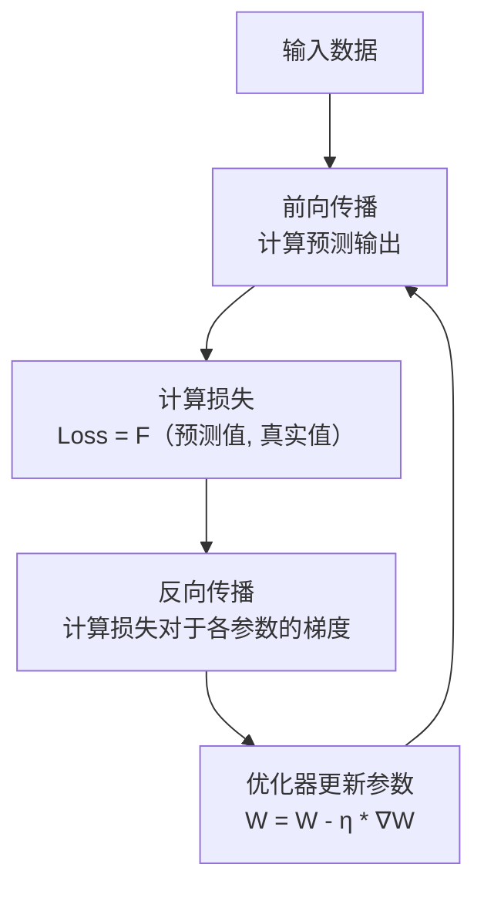
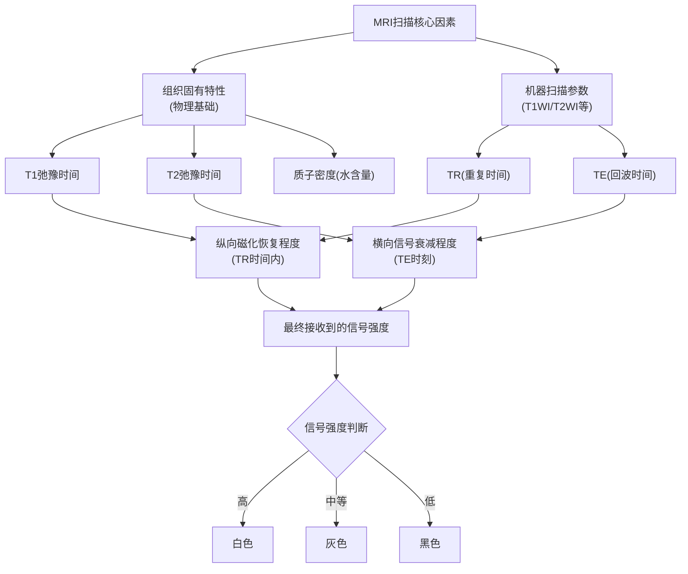

# 神经网络、深度学习
训练training
推理inference

dice

loss function

convolution

pooling

relu

sigmoid

softmax

cross entropy

batch normalization

dropout

gradient descent

adam

learning rate

optimizer

activation function

backpropagation

neural network

deep learning

tensorflow

pytorch

keras

cnn

rnn

lstm

gru

transformer

bert

gpt

gan

vae

autoencoder

attention mechanism

神经网络 术语

好的，神经网络领域的术语非常丰富。为了让你能系统地理解，我将它们分门别类，从基础到高级进行介绍。这是一个庞大的知识体系，但掌握这些术语对于阅读论文、理解模型和与他人交流至关重要。

### 一、核心基础概念

| 术语 | 解释 | 类比 |
| :--- | :--- | :--- |
| **人工神经元 (Artificial Neuron)** | 神经网络的基本计算单元。它接收输入，进行加权求和，并通过一个激活函数产生输出。 | 像大脑中的一个神经细胞。 |
| **输入 (Input)** | 送入神经网络的数据。例如，图像中的像素值、一句话的单词编码等。 | 待加工的原材料的。 |
| **权重 (Weight)** | 每个输入连接的重要性系数。训练神经网络主要就是学习这些权重的最佳值。 | 水龙头的阀门。拧大拧小决定了水流量（重要性）。 |
| **偏置 (Bias)** | 一个常量，与加权求和的结果相加，用来调整神经元的输出灵活性。 | 一个基准线，让模型更容易拟合数据。 |
| **加权求和 (Weighted Sum)** | 计算所有输入与其对应权重的乘积之和，再加上偏置。即 `z = (w1*x1 + w2*x2 + ... + wn*xn) + b`。 | 厨师尝汤后，决定加多少盐和胡椒（权重）来调味。 |
| **激活函数 (Activation Function)** | 作用于加权求和结果的函数，引入非线性，使网络能够学习复杂模式。常见的有 **Sigmoid**, **ReLU**, **Tanh** 等。 | 一个开关或阀门，决定这个神经元是否应该被“激活”（输出信号）。 |
| **输出 (Output)** | 神经元或整个网络计算后的最终结果。例如，分类的概率、回归的数值等。 | 加工完成后的产品。 |
| **前向传播 (Forward Propagation)** | 数据从输入层经过隐藏层最终到达输出层的过程。 | 原材料在工厂的流水线上经过一道道工序。 |

---

### 二、网络结构相关

| 术语 | 解释 |
| :--- | :--- |
| **层 (Layer)** | 一组神经元的集合。 |
| **输入层 (Input Layer)** | 接收原始数据的第一层。 |
| **隐藏层 (Hidden Layer)** | 介于输入层和输出层之间的所有层，负责进行特征提取和转换。 |
| **输出层 (Output Layer)** | 产生最终结果的最后一层。其激活函数取决于任务（如Softmax用于分类）。 |
| **全连接层 (Fully-Connected Layer, FC)** | 一层中的每个神经元都与前一层的所有神经元相连。 |
| **深度 (Depth)** | 网络中隐藏层的数量。层数多就叫“深度学习”。 |
| **参数 (Parameters)** | 模型中所有权重和偏置的总称。“模型有多大”通常指参数数量。 |

---

### 三、训练与学习相关

| 术语 | 解释 |
| :--- | :--- |
| **训练 (Training)** | 使用数据自动调整网络参数（权重和偏置）的过程。 |
| **损失函数 (Loss Function)** | 衡量模型预测值与真实值之间差距的函数。训练的目标就是最小化这个函数。常见的有**均方误差（MSE）**、**交叉熵损失（Cross-Entropy Loss）**。 |
| **优化器 (Optimizer)** | 用于最小化损失函数的算法。它决定了如何根据损失函数的梯度来更新权重。常见的有**SGD**（随机梯度下降）、**Adam**、**RMSprop**。 |
| **反向传播 (Backpropagation)** | 计算损失函数对每个参数的梯度（导数）的算法。是训练神经网络的核心算法，指导优化器如何更新参数。 |
| **学习率 (Learning Rate)** | 优化器中的一个超参数，控制每次参数更新的步长。太大可能无法收敛，太小则训练过慢。 |
| ** epoch** | 整个训练数据集完整地通过神经网络一次并进行参数更新。 |
| **批次 (Batch)** | 由于内存限制，通常将训练数据分成多个小块（批次）进行训练。 |
| **批次大小 (Batch Size)** | 每个批次中包含的样本数量。 |
| **迭代 (Iteration)** | 一个批次的训练完成一次参数更新。 |
| **梯度下降 (Gradient Descent)** | 一种通过迭代地沿着梯度反方向（下降最快）更新参数来最小化损失函数的方法。 |

---

### 四、特殊层与架构

| 术语 | 解释 | 主要应用 |
| :--- | :--- | :--- |
| **卷积层 (Convolutional Layer)** | 使用卷积核（滤波器）来提取局部特征（如边缘、纹理）。 | **计算机视觉（CV）** |
| **池化层 (Pooling Layer)** | 对特征图进行下采样，减少数据量，增加平移不变性。如最大池化（Max Pooling）。 | **计算机视觉（CV）** |
| **循环神经网络 (RNN)** | 具有循环连接的神经网络，能够处理序列数据（如时间序列、文本）。 | **自然语言处理（NLP）** |
| **长短期记忆网络 (LSTM)** | RNN的一种特殊形式，通过“门”机制有效解决长序列依赖问题。 | **NLP，语音识别** |
| **Transformer** | 完全基于自注意力（Self-Attention）机制的架构，并行化能力强，已成为NLP等领域的主流。 | **NLP（如BERT, GPT）, CV** |
| **嵌入层 (Embedding Layer)** | 将离散的类别变量（如单词）映射为密集的连续向量表示。 | **NLP，推荐系统** |
| **注意力机制 (Attention Mechanism)** | 让模型能够专注于输入中更重要的部分进行计算。 | **NLP, CV, 多模态** |
| **Dropout** | 一种正则化技术，在训练过程中随机“丢弃”一部分神经元，防止过拟合。 | **通用** |
| **批量归一化 (Batch Normalization)** | 对每一层的输入进行标准化，加速训练并提升稳定性。 | **通用** |

---

### 五、评估与问题

| 术语 | 解释 |
| :--- | :--- |
| **过拟合 (Overfitting)** | 模型在训练数据上表现很好，但在未见过的测试数据上表现很差。意味着模型“死记硬背”了训练数据，而非学习通用规律。 |
| **欠拟合 (Underfitting)** | 模型在训练数据和测试数据上都表现不佳。意味着模型能力不足，无法捕捉数据中的基本模式。 |
| **正则化 (Regularization)** | 用于防止过拟合的一系列技术（如L1/L2正则化、Dropout）。 |
| **准确率 (Accuracy)** | 分类任务中，预测正确的样本占总样本的比例。 |
| **精确率 (Precision)** | **预测为正例**的样本中，真正为正例的比例。（“找得对”） |
| **召回率 (Recall)** | **真实为正例**的样本中，被预测为正例的比例。（“找得全”） |
| **F1 Score** | 精确率和召回率的调和平均数，综合衡量模型性能。 |

---

### 核心概念关系图

下图展示了训练过程中，**前向传播**、**损失计算**、**反向传播**和**参数更新**这四个核心步骤如何循环运作，最终通过**优化器**最小化**损失函数**：

希望这份术语表能成为你学习神经网络的有力工具！

检测:肿瘤在哪里，应该就是识别 detection
分割:肿瘤完整准确的边界 segmentation
诊断:良恶性和具体类型 diagnosis

nnUnet:
https://github.com/MIC-DKFZ/nnUNet 源码
https://zenodo.org/records/4003545 预训练模型

# MR图像阅读
## 成像原理
### 一、 基本原理

核磁共振成像的原理基于**氢原子核**（即质子，人体内含量丰富，尤其在水中和脂肪中）的物理特性。
脂肪是由甘油和脂肪酸组成的甘油三酯，其化学通式为C₃H₅(OOCR)₃，其中R代表不同脂肪酸的烃基。

1.  **施加主磁场**：当您进入MRI机器时，强大的静态磁场（通常为1.5T或3.0T，T代表特斯拉）会使您身体内杂乱无章的氢质子磁矩沿磁场方向排列。
2.  **发射射频脉冲**：然后，机器会发射一个特定频率的无线电波（射频脉冲）。这个脉冲会使氢质子吸收能量，发生**共振**，并偏离原来的排列方向。
3.  **关闭脉冲，接收信号**：当射频脉冲关闭后，被激发的氢质子会逐渐释放吸收的能量，并回到原来的平衡状态。这个过程称为**弛豫**。MRI机器周围的接收线圈会捕捉到这个过程中释放的微弱无线电信号。
4.  **生成图像**：计算机对接收到的信号进行复杂的处理，通过分析信号的空间频率和强度，最终重建出我们看到的解剖图像。

**核心关键**：MRI图像上的**亮度（信号强度）** 并不直接对应某种单一的物理量（如密度），而是取决于**组织本身的特性**（如氢质子含量、流动性）和**机器参数的设置**（如重复时间TR、回波时间TE）。不同的组织有不同的弛豫速度，这是我们能够区分它们的基础。

---

### 二、 数值范围与含义

这是一个非常重要的概念：**MRI信号没有绝对的数值范围**。

*   **相对信号**：MRI图像上的亮度是**相对的**。我们通常用**高信号（亮/白）**、**等信号（灰）**、**低信号（暗/黑）** 来描述，其参照物通常是**肌肉**或**脑灰质/白质**。
*   **为什么没有绝对值？** 同一组织在不同机器、不同扫描参数下产生的信号强度值（一个具体的数字）会完全不同。因此，临床诊断从不依赖绝对值，而是依赖**同一张图像上不同组织之间的信号对比**，以及**同一组织在不同序列上的表现**。

**图像含义总结**：
*   **白色（高信号）**：代表该区域组织在特定序列上释放了较强的信号。
*   **黑色（低信号）**：代表该区域组织释放的信号很弱或没有。
*   **灰色（等信号）**：代表该区域组织的信号强度与参照组织相似。

---

### 三、 不同序列的含义与用途

序列是MRI的灵魂。通过调整射频脉冲的施加方式和信号采集时机（主要是TR和TE时间），我们可以突出不同组织的弛豫特性差异，从而获得不同类型的图像。

#### 1. T1加权像

*   **物理原理**：主要反映组织**纵向磁化恢复**的快慢。脂肪纵向弛豫很快，所以信号高。
*   **图像特点**：
    *   **脂肪**：高信号（白色）
    *   **脑白质**：比脑灰质**亮**（白色更多）
    *   **脑灰质**：比脑白质**暗**（灰色）
    *   **液体**（脑脊液、水）：低信号（黑色）
    *   **骨骼/空气**：低信号（黑色）
*   **主要用途**：观察**正常的解剖结构**，显示脂肪、亚急性出血、富含蛋白的液体等。是显示解剖细节的最佳序列。

#### 2. T2加权像

*   **物理原理**：主要反映组织**横向磁化衰减**的快慢。水分子横向弛豫很慢，所以信号能维持很久，信号高。
*   **图像特点**：（与T1WI几乎相反）
    *   **液体**（脑脊液、水肿、囊肿）：高信号（很白）
    *   **脑白质**：比脑灰质**暗**
    *   **脑灰质**：比脑白质**亮**
    *   **脂肪**：较高信号（白色，但不如T1上那么亮）
    *   **骨骼/空气**：低信号（黑色）
*   **主要用途**：检测**病理变化**，因为绝大多数病变（如炎症、肿瘤、梗死、水肿）都伴有水含量的增加，在T2WI上会表现为明显的高信号，如同“灯亮了一样”，非常容易发现。

#### 3. FLAIR

*   **全称**：Fluid Attenuated Inversion Recovery（液体衰减反转恢复序列）
*   **本质**：它是一种**特殊的T2加权序列**，在成像前先加一个反转脉冲， selectively 抑制掉**自由水**（如脑脊液）的信号。
*   **图像特点**：
    *   **脑脊液**：低信号（黑色）—— 这是与普通T2WI最核心的区别。
    *   **病变组织/水肿**：依然保持高信号（白色）。
*   **主要用途**：是颅脑检查的“王牌”序列。它让本该很亮的脑脊液变黑，从而使紧挨着脑室或脑池的病变（如腔隙性梗死、多发性硬化斑块）的高信号无所遁形，避免了在普通T2WI上被明亮的脑脊液信号所淹没。

#### 4. 其他重要序列

*   **DWI（扩散加权成像）**：
    *   **原理**：检测水分子随机布朗运动的自由度。在急性脑梗死或某些肿瘤中，细胞毒性水肿导致细胞肿胀，细胞外间隙变小，水分子扩散受限。
    *   **图像特点**：扩散受限的区域表现为**异常高信号**。
    *   **用途**：**急性脑梗死**的早期诊断（发病数分钟内即可显示），脓肿、某些肿瘤的鉴别诊断。通常会配合**ADC图**（表观扩散系数图）一起看，在ADC图上扩散受限区域表现为低信号。

*   **T2*/SWI（磁敏感加权成像）**：
    *   **原理**：对顺磁性物质（如脱氧血红蛋白、铁沉积、钙化、出血产物）非常敏感。
    *   **图像特点**：这些物质会导致局部磁场不均匀，信号丢失，表现为**极低的黑色信号**。
    *   **用途**：检测**微出血**、**海绵状血管瘤**、**钙化**等。

*   **增强扫描（T1WI + Contrast）**：
    *   **原理**：静脉注射钆类对比剂后再次扫描T1WI。对比剂会缩短组织的T1弛豫时间，使血供丰富或血脑屏障破坏的区域（如肿瘤、炎症）信号显著增高（变亮）。
    *   **用途**：评估肿瘤边界、血供、炎症活动性、转移灶等。

---

### 总结对比表格

| 序列 | 脂肪 | 脑脊液/水 | 正常脑白质 vs 灰质 | 水肿/病变 | 主要临床用途 |
| ：--- | :--- | :--- | :--- | :--- | :--- |
| **T1WI** | **很白** | **很黑** | 白质 > 灰质（白质更白） | 等/稍低信号 | 显示解剖结构、脂肪、出血 |
| **T2WI** | 白 | **很白** | 灰质 > 白质（灰质更白） | **很白** | 检测病变、水肿 |
| **FLAIR** | 白 | **很黑（被抑制）** | 灰质 > 白质 | **很白** | 显示紧邻脑室的病变 |
| **DWI** | 可变 | 黑（ADC图低） | 等信号 | **很白（扩散受限）** | 急性脑梗死、脓肿 |
| **T2\*/SWI** | - | - | - | **极黑（出血/钙化）** | 检测微出血、钙化 |

简单来说，**看解剖找T1，找病变看T2，靠近脑室看FLAIR，超早中风看DWI，查出血看SWI**。

## MR图像黑白灰与组织特性 水分子含量、排列、环境 序列 时间之间的关系
好的，这是一个非常核心且精彩的问题。它直接关系到如何理解MRI图像对比度的形成。我们来深入探讨一下MRI图像中**信号的白、灰、黑**与**组织特性**（水分子含量、分子排列/环境）以及**扫描时间参数**之间的物理关系。

为了更直观地理解这个过程，我们可以通过以下流程图来揭示其核心逻辑：

上图展示了从组织特性到图像信号的全过程，而组织的这些特性又由其水分子环境决定：

---

### 一、 核心关系：信号强度由什么决定？

MRI图像的亮度（信号强度）并非由单一因素决定，而是由以下三者共同作用，其中**机器的扫描参数（TR/TE）决定了我们更关心哪个组织的固有属性**：

1.  **组织固有属性（物理基础）**：
    *   **质子密度**：组织中氢质子（主要存在于水分子和脂肪中）的多少。质子越多，可产生的信号潜力就越大。
    *   **T1弛豫时间**：组织纵向磁化恢复快慢的指标。恢复快的组织（如脂肪）**T1时间短**，在T1加权像上信号高（白）。
    *   **T2弛豫时间**：组织横向磁化衰减快慢的指标。衰减慢的组织（如纯水）**T2时间长**，在T2加权像上信号高（白）。

2.  **机器扫描参数（观察方式）**：
    *   **重复时间**：两个射频脉冲之间的间隔时间。它决定了扫描时允许组织进行**T1弛豫的时间**。
    *   **回波时间**：发射射频脉冲到采集信号之间的等待时间。它决定了扫描时允许组织进行**T2弛豫的时间**。

通过巧妙设置TR和TE，我们可以制造出突出T1差异、T2差异或质子密度差异的图像，即**T1加权像、T2加权像和质子密度加权像**。

---

### 二、 组织特性与水分子含量/排列的关系

组织的T1和T2时间并非随机，而是由其**水分子含量**和**分子排列/环境**（即水被“束缚”的程度）决定的。

| 组织类型 | 水分子含量与环境 | T1弛豫时间 | T2弛豫时间 | 根本原因 |
| :--- | :--- | :--- | :--- | :--- |
| **自由水** （如：脑脊液、囊肿） | 含量极高，水分子自由运动，频率高 | **长** | **长** | 水分子运动太快，难以有效将能量传递给周围环境（T1长）；分子间相互作用弱，相位分散慢（T2长）。 |
| **结合水/水肿** （如：肿瘤、炎症） | 含量高，水分子被生物大分子“束缚”，运动频率中等 | 中等 | **长** | 运动频率接近Larmor频率，能高效传递能量（T1不长不短）；环境仍相对均匀，相位分散较慢（T2长）。 |
| **脂肪** | 含量不高，但分子（-CH₂-）运动频率接近Larmor频率 | **短** | 中等 | 分子运动频率完美匹配，能极高效地将能量传递给周围晶格，T1恢复极快（T1短）。 |
| **正常脑白质** | 含水量较低，有致密的髓鞘（脂质）包裹 | 短 | 短 | 脂质含量高导致T1短；髓鞘结构不均匀导致局部磁场不均，加速相位分散（T2短）。 |
| **正常脑灰质** | 含水量较高，神经元细胞体密集 | 中等 | 中等 | 含水量和脂质含量介于白质和纯水之间，故T1、T2时间也居中。 |
| **骨骼、钙化、空气** | 质子含量极低 | - | - | 几乎没有可探测的氢质子，**永远低信号（黑）**。 |

---

### 三、 在不同加权像上的具体表现

现在，我们将**组织特性**和**扫描参数**结合起来，就能完美解释图像上的白、灰、黑了。

#### 1. T1加权像

*   **扫描参数**：**短TR** + **短TE**
*   **核心机制**：短TR只给了组织很短的恢复时间。**T1短的组织（如脂肪）恢复得快**，能贡献大量信号，呈现**白色**。**T1长的组织（如水）来不及恢复**，信号弱，呈现**黑色**。
*   **表现**：
    *   **脂肪**：白（T1短）
    *   **脑白质**：较白（相比灰质，T1更短）
    *   **脑灰质**：灰
    *   **脑脊液/水**：黑（T1长）
    *   **骨骼**：黑（无质子）

#### 2. T2加权像

*   **扫描参数**：**长TR** + **长TE**
*   **核心机制**：长TE给了组织很长的衰减时间。**T2长的组织（如水）信号衰减得慢**，在采集信号时仍有强信号，呈现**白色**。**T2短的组织（如白质）信号衰减得快**，在采集信号时信号已所剩无几，呈现**黑色**。
*   **表现**：
    *   **脑脊液/水/水肿**：白（T2长）
    *   **脑灰质**：较白（相比白质，T2更长）
    *   **脑白质**：较黑（T2短）
    *   **脂肪**：灰白（T2中等）
    *   **骨骼**：黑（无质子）

#### 3. 质子密度加权像

*   **扫描参数**：**长TR** + **短TE**
*   **核心机制**：长TR使所有组织的纵向磁化都充分恢复，消除了T1效应；短TE使得大家还没来得及发生T2衰减就采集了信号，消除了T2效应。此时信号强度**仅由质子多少决定**。
*   **表现**：
    *   **水、灰质、白质**：信号强度直接反映其水含量，水>灰质>白质。
    *   **脂肪**：仍较亮（虽含水不多，但氢质子密度高）。
    *   **骨骼**：黑。

---

### 总结

*   **白**：代表在特定序列参数下，该组织的弛豫特性（**短T1** 或 **长T2**）或高质子密度导致了**强信号**。
*   **黑**：代表该组织具有**长T1** 或 **短T2** 特性，或**缺乏氢质子**，导致**信号弱**。
*   **灰**：代表该组织的弛豫特性和质子密度处于中间状态。

**最终关系链**：
**水分子含量与分子环境** → 决定了组织的 **T1和T2弛豫时间** → 通过选择不同的 **TR和TE** 扫描参数来“捕捉”这些差异 → 最终形成了MRI图像上我们所看到的 **白、灰、黑** 对比。

## T1纵向恢复时间 T2横向衰减时间的物理本质
---

### 核心比喻：晒太阳的指南针

想象一下，把一堆小指南针（好比是水中的氢质子）放在一个强大的南北向磁场（MRI主磁场，称为 **B0**）中。
*   所有指南针（质子）都会指向**北方**（沿着磁场方向）。这个集体指向北方的磁力，就是 **“纵向磁化”**。
*   此时，从侧面（横向）看，没有磁力，我们探测不到任何信号。

### 1. 纵向与横向是什么意思？

这指的是在MRI机器强大的主磁场（**B0**）中，质子磁化矢量的**方向**。

*   **纵向磁化**：
    *   **方向**：与主磁场 **B0** 方向一致（平行）。对于躺在机器里的人来说，通常就是从头到脚的方向。
    *   **来源**：在自然状态下，大部分质子都沿着主磁场方向排列，就像指南针指向北方一样。这些质子共同产生了一个稳定的、强大的净磁化矢量，我们称之为**纵向磁化**。
    *   **特点**：**我们无法直接测量到纵向磁化**。它太大、太稳定了，就像地球的磁场一样，我们身在其中感觉不到。

*   **横向磁化**：
    *   **产生**：当机器发射**射频脉冲**（一种无线电波）后，它会给质子能量，使它们从纵向“翻倒”90度或180度。当它们同步地倒在同一个方向上旋转时，就产生了 **横向磁化**。
    *   **方向**：与主磁场 **B0** 方向垂直（水平面）。
    *   **特点**：**这是我们能唯一探测到的信号！** 横向磁化矢量在旋转时，会切割接收线圈，从而产生我们可以测量的电信号。**MRI图像的所有信号都来自于横向磁化。**

### 2. 弛豫：恢复到平静状态的过程

当射频脉冲关闭后，被激发的质子会像放松下来一样，逐渐释放能量，回到它们原来的平静状态（即全部沿着B0磁场方向排列）。这个“放松”的过程就叫做 **弛豫**。

弛豫过程同时包含两个独立但又同时发生的过程：
1.  **纵向磁化的恢复**（T1弛豫）
2.  **横向磁化的消失**（T2弛豫）

### 3. T1弛豫时间（纵向恢复时间）

*   **它是什么**：**T1时间衡量的是纵向磁化恢复速度快慢的指标。**
*   **物理过程**：射频脉冲关闭后，质子会将吸收的能量释放给周围的环境（称为“晶格”或“网络”），从而逐步恢复到原来的纵向排列状态。纵向磁化从0恢复到其最大值的63%所需的时间，就被称为该组织的T1时间。
*   **可以理解为“能量消散”或“复位”的时间**。
*   **与组织的关系**：
    *   **T1时间短**：意味着恢复得快。通常发生在分子运动频率与射频脉冲频率接近的物质中，如**脂肪**。脂肪在T1加权像上呈**白色（高信号）**。
    *   **T1时间长**：意味着恢复得慢。通常发生在分子运动非常自由或非常缓慢的物质中，如**纯水（脑脊液）**。水在T1加权像上呈**黑色（低信号）**。

### 4. T2弛豫时间（横向衰减时间）

*   **它是什么**：**T2时间衡量的是横向磁化衰减速度快慢的指标。**
*   **物理过程**：射频脉冲刚结束时，所有质子都在同步旋转（同相位），产生强大的横向磁化。但由于每个质子周围的微观磁场环境有微小差异，它们的旋转速度开始出现细微差别，逐渐变得**不同步（失相位）**。当它们不再朝一个方向努力时，总的横向磁化就衰减消失了。横向磁化从最大值衰减到37%所需的时间，就被称为该组织的T2时间。
*   **可以理解为“同步性丧失”或“散伙”的时间**。
*   **与组织的关系**：
    *   **T2时间短**：意味着衰减得快。通常发生在分子环境不均匀、相互作用强的物质中，如**蛋白质丰富的液体、脑白质**。这些组织在T2加权像上呈**黑色（低信号）**。
    *   **T2时间长**：意味着衰减得慢。通常发生在分子环境均匀、自由运动的物质中，如**纯水（脑脊液）**。水在T2加权像上呈**白色（高信号）**。

---

### 总结与对比

| 特性 | T1弛豫（纵向恢复） | T2弛豫（横向衰减） |
| :--- | :--- | :--- |
| **俗称** | **自旋-晶格弛豫** | **自旋-自旋弛豫** |
| **过程** | 恢复纵向磁化 | 衰减横向磁化 |
| **物理本质** | 质子将能量**传递给周围环境** | 质子之间**失去同步性**，相互散相 |
| **决定信号** | **不直接产生信号**，但决定了下次能有多少质子可被激发 | **直接产生我们接收到的信号** |
| **典型组织** | **短T1（亮）**：脂肪 | **长T2（亮）**：水、水肿 |
| | **长T1（暗）**：水、尿液 | **短T2（暗）**：肌腱、韧带、旧出血 |

**最重要的要点**：
T1和T2弛豫是**两个独立且同时发生**的过程。**T1时间**描述的是质子**“躺下后又坐起来”** 的速度，而**T2时间**描述的是质子**“一起鼓掌后变得杂乱无章”** 的速度。通过测量不同组织的T1和T2时间差异，MRI就能创造出拥有极高软组织对比度的图像。

## MR扫描技术与方法总结

MR扫描技术的选择与组合，决定了图像所提供的信息内容（解剖、功能、代谢等）。以下是主要的分类和总结：

#### 一、 核心脉冲序列：决定图像对比度

这是MRI技术的基石，通过操控射频脉冲和信号采集时机（TR, TE, TI）来突出组织的不同物理特性。

| 序列类型 | 核心原理 | 主要临床用途 | 典型表现 |
| :--- | :--- | :--- | :--- |
| **T1加权成像 (T1WI)** | 突出组织**T1弛豫时间**差异 | **观察解剖结构**：显示脂肪、亚急性出血、正常器官结构 | **脂肪：白**   **水/脑脊液：黑**   **肌肉：灰** |
| **T2加权成像 (T2WI)** | 突出组织**T2弛豫时间**差异 | **检测病理变化**：显示水肿、炎症、肿瘤、液体 | **水/脑脊液：很白**   **实性组织：灰**   **韧带/骨：黑** |
| **质子密度加权成像 (PDWI)** | 突出组织**氢质子密度**差异 | 关节成像（如膝关节半月板）、某些脑部序列 | 信号强度直接反映水含量 |
| **液体衰减反转恢复 (FLAIR)** | T2WI基础上**抑制自由水**（如脑脊液）信号 | **颅脑疾病**：显示紧邻脑室的病变（如MS斑块、梗死灶） | **病变：白**   **脑脊液：黑** |
| **短时反转恢复 (STIR)** | T2WI基础上**抑制脂肪**信号 | **检出病变**：避免脂肪高信号掩盖病变；全身筛查 | **水肿/病变：白**   **脂肪：黑** |
| **梯度回波 (GRE)** | 快速成像，对**磁敏感效应**敏感 | 快速扫描、动态增强、血管成像（MRA）、出血检测（T2*WI） | 扫描速度快，易产生磁化伪影 |

---

#### 二、 高级与功能成像序列

这些序列提供了超越常规解剖信息的功能性、代谢性或组织特异性数据。

| 序列类型 | 核心原理 | 主要临床用途 |
| :--- | :--- | :--- |
| **扩散加权成像 (DWI)** | 检测水分子**布朗运动**（扩散）的自由度 | **急性脑梗死**（金标准）、**肿瘤鉴别**、脓肿 |
| **表观扩散系数 (ADC)** | DWI的定量图，去除T2“透过效应” | 确认扩散是否**真实受限**（ADC值低） |
| **磁敏感加权成像 (SWI)** | 对**顺磁性物质**（如出血、铁、钙）极度敏感 | **微出血**、**海绵状血管瘤**、**静脉成像** |
| **磁共振波谱 (MRS)** | 检测体内**生化代谢物**的含量 | 肿瘤分级、鉴别放疗坏死与复发、代谢性疾病 |
| **灌注加权成像 (PWI)** | 评估组织**血流灌注**情况 | 脑缺血半暗带评估、肿瘤血供评估 |
| **扩散张量成像 (DTI)** | 显示水分子**各向异性**扩散，追踪白质纤维束 | **神经纤维束成像**、术前规划、脑科学研究 |
| **磁共振血管成像 (MRA)** | 无需对比剂（TOF法）或使用对比剂（CE-MRA）显示血管 | **动脉瘤**、**血管狭窄**、**血管畸形** |
| **磁共振胰胆管成像 (MRCP)** | 重T2WI序列静态水（胆汁、胰液）呈高信号 | **胆道结石**、**胰胆管扩张** |

---

#### 三、 对比剂的应用

*   **名称**：钆（Gd）对比剂
*   **机制**：缩短周围组织的T1弛豫时间，使血供丰富或血脑屏障破坏的区域在T1WI上信号增高（变亮）。
*   **序列**：**T1WI + Contrast (T1+C or T1GD)**
*   **用途**：肿瘤定性、炎症活动性评估、转移灶筛查、血管精细显示。

---

#### 四、 扫描平面方位

定义图像获取的视角，通常需至少两个方位以进行三维定位。
*   **横断位 / 轴位 (Axial/TRA)**：最基础、最常用的方位，从上到下切割。
*   **矢状位 (Sagittal/SAG)**：从左右方向切割，是观察中线结构（大脑、脊髓）的关键。
*   **冠状位 (Coronal/COR)**：从前后方向切割，常用于垂体、颞叶、关节等部位的观察。

---

#### 五、 关键技术参数与技巧

1.  **门控与触发**：
    *   **心电门控 (ECG Gating)**：消除心脏搏动伪影，用于心脏MRI、大血管成像。
    *   **呼吸触发 (Respiratory Triggering)**：消除呼吸运动伪影，用于胸腹部扫描。

2.  **并行采集技术 (e.g., SENSE, GRAPPA)**：
    *   利用多通道线圈同时采集信号，大幅**缩短扫描时间**或提高分辨率。

3.  **压缩感知 (Compressed Sensing)**：
    *   一种更先进的快速成像技术，通过算法大幅减少所需采集的数据量，实现**极速扫描**。

### 总结

MR扫描是一个极其灵活的平台。 radiologist 和技师会根据**临床需求**（怀疑什么病），从上述“技术工具箱”中选择合适的序列、方位、参数进行组合，生成一套**个性化的扫描方案（Protocol）**，以期获得最全面的诊断信息。

*   **看解剖**：**T1WI**
*   **找病变**：**T2WI, FLAIR, STIR**
*   **查急性中风**：**DWI**
*   **看出血**：**SWI, T2* GRE**
*   **评肿瘤**：**T1WI + C**（增强）
*   **看血管**：**MRA**
*   **看代谢**：**MRS**
*   **看神经纤维**：**DTI**